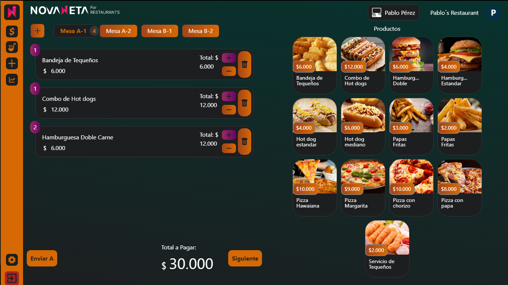

# <strong>NOVANETA</strong>   Software de Gestión para Restaurantes

This project was bootstrapped with [Create React App](https://github.com/facebook/create-react-app).

## Available Scripts

In the project directory, you can run:

### Develoment

### `npm start`

### Production

### `npm run build`

## this project was build with:

<ul>
  <li>TypeScript</li>
  <li>React.js</li>
  <li>Styled-components</li>
  <li>Firebase</li>
  <li>Tailwind CSS (for Tremor Components styles)</li>
  <li>react-to-print Library (for print invoices)</li>
  <li>Sheet.js Library (for push data into excel file)</li>
  <li>xlsx-js-style (styles to sheetjs)</li>
  <li>Lottiefiles Library</li>
  <li>react-device-detect Library</li>
  <li>Tremor Components (use Tailwind CSS)</li>
  <li>react-infinite-scroll-component</li>
</ul>

## If you want to view this project in production, Click <strong>[HERE](https://novaneta-restaurants.vercel.app/)</strong> 👈.

Also if you want to use my firebase env variables, then send me a mail at <m.casa2017@outlook.com>
